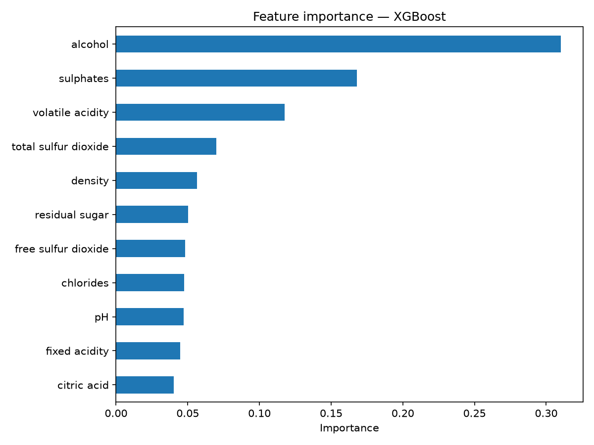
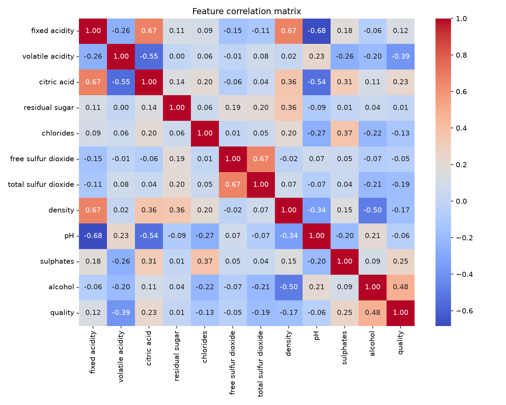

# Wine Quality Prediction

Predicting red wine quality from physicochemical properties, with a focus on
**comparing models properly** rather than just fitting one and reporting accuracy.

## Dataset

[UCI Wine Quality dataset](https://archive.ics.uci.edu/ml/datasets/wine+quality) (red wine variant)
— 1,599 samples, 11 physicochemical features (acidity, sugar, sulphates, alcohol, etc.),
predicting a quality score from 3–8.

Source: Cortez, P., Cerdeira, A., Almeida, F., Matos, T., & Reis, J. (2009).
*Modeling wine preferences by data mining from physicochemical properties.*
Decision Support Systems, 47(4), 547-553.

## Approach

Rather than training a single model, this project compares three regressors
under identical train/test conditions:

- **Linear Regression** — baseline, to check whether added model complexity is actually justified
- **Random Forest** — non-linear ensemble, also yields feature importance
- **XGBoost** — gradient boosting, the typical go-to for tabular data

Each model is evaluated with **RMSE, MAE, and R²** (not just accuracy, which
doesn't make sense for an ordinal/continuous quality score), plus 5-fold
cross-validation to check how sensitive results are to the train/test split.

## Results

| Model             | RMSE   | MAE    | R²     | CV R² (mean) | CV R² (std) |
|-------------------|--------|--------|--------|--------------|-------------|
| Random Forest     | 0.5535 | 0.4249 | 0.5312 | 0.4317       | 0.0681      |
| XGBoost           | 0.6018 | 0.4796 | 0.4458 | 0.3853       | 0.0719      |
| Linear Regression | 0.6245 | 0.5035 | 0.4032 | 0.3217       | 0.0595      |

**Random Forest performed best.** This is a bit counterintuitive if you'd
expect gradient boosting to always win — but on a small dataset (~1,600 rows)
with no hyperparameter tuning, Random Forest's bagging tends to generalize
better than XGBoost out of the box, which is more sensitive to tuning.

The gap between test R² and cross-validation R² for every model (e.g. Random
Forest: 0.53 test vs 0.43 CV mean) indicates performance is somewhat sensitive
to the specific train/test split — expected given the dataset's small size and
imbalanced quality distribution (most wines score 5 or 6; very few score 3 or 8).

### Feature importance (Random Forest)



**Alcohol and sulphates are the strongest predictors of quality**, followed by
volatile acidity. This lines up with the correlation analysis below and with
domain knowledge — higher alcohol content and sulphate levels (a preservative
and antimicrobial agent) are generally associated with wines rated higher
quality, while high volatile acidity (which produces a vinegar-like taste) is
associated with lower quality.

### Correlation matrix



## What I'd improve with more time

- Hyperparameter tuning (grid/random search) for Random Forest and XGBoost,
  since neither was tuned here — the comparison reflects default performance
- Address class imbalance in the quality scores (e.g. via SMOTE or reframing
  as ordinal classification instead of regression)
- Try the white wine variant of the dataset and check if feature importance
  patterns hold across both

## Running it

```bash
pip install pandas numpy scikit-learn xgboost matplotlib seaborn
python wine_quality_prediction.py
```

Outputs `correlation_matrix.png`, `feature_importance.png`, and
`model_comparison_results.csv` in the working directory.
